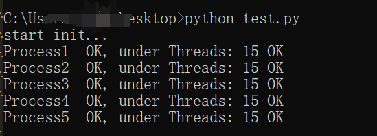
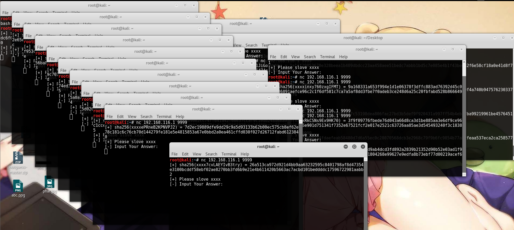
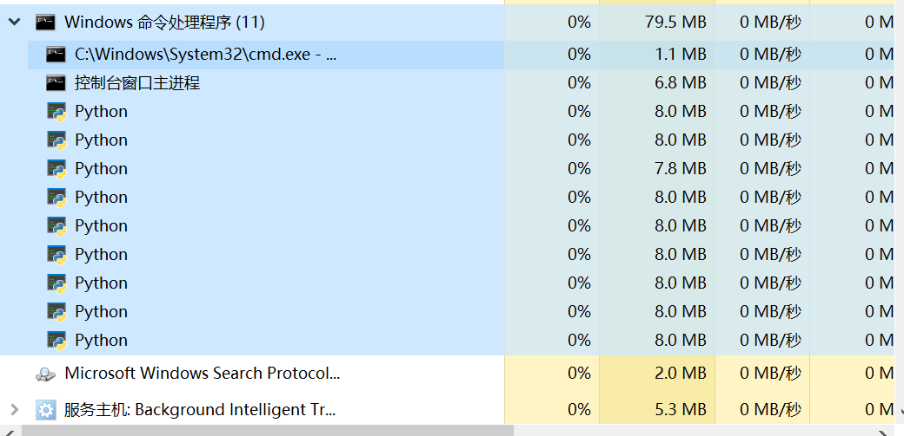
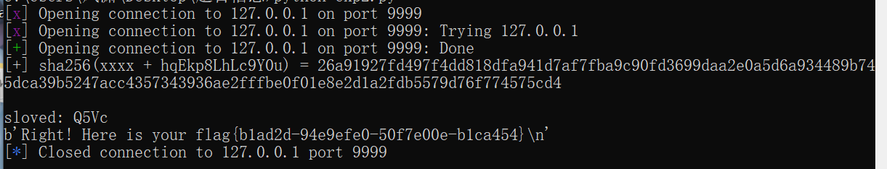

## 使用原生socket库实现crypto场景中的高并发

#### 前言

平时一直做ctf赛题，大多数情况下都是没给出socket交互部分源码

一方面是为了选手能快速读懂题目，另一方面能避免题目之外的代码余

这时候如果想自己出和服务器交互类题的话一般要么去找封装库，要么去要一些其他的源码，都比较繁琐，而且效率不是特别高，所以在服务器资源既定的情况下，还是最好用原生类库来实现

#### 使用

##### **初始化参数**

socket_service(host,port,threading_nums,process_nums,listen_num)

参数分别如英文字面意思

Main() 运行 可以直接通过 socket_service(args...).Main()来运行

##### **核心修改处及修改规范**

如果需要做成题目，只需要修改vertify函数，自定义另外的函数可像hash_funk一样定义

vertify函数里放完整的crypto题即可

用socket_handle.send 替代原来的 print

用socket_handle.recv(1024) 替代原来的 input

**注意发送数据类型必须为bytes类型**

#### 开发

##### **导入库**

socket socket通信

queue 消息队列

multiprocessing 并行

threading 并发

random string  os  hashlib题目有关库

time datetime 日志记录相关

##### **函数**

main，init_Process，socket_task，init_Thread，thread_task，printStackTrace分别为并发并行的处理，日志的打印

vertify为题目入口函数

hash_funk为辅助函数

#### **源码**

```python
import socket
import queue
import multiprocessing
import threading
import random
import string
import os
from hashlib import sha512
from time import sleep
from datetime import datetime

queue = queue.Queue(maxsize=300)
# max_handle_number_at_same_time = threading_nums * process_nums

class socket_service:
	def __init__(self,host='0.0.0.0',port=9999,threading_nums=15,process_nums=5,listen_num=300):
		self.threading_nums = threading_nums
		self.process_nums = process_nums
		self.socket = socket.socket()
		self.socket.bind((host,port))
		self.socket.listen(listen_num)

	def printStackTrace(self,e,current_name=""):
		print("\n" + str(datetime.now())[:-7] + " "+ str(current_name) + " Error: " + str(e) + "\nat " + str(e.__traceback__.tb_frame.f_globals["__file__"]) + "\nat line: " + str(e.__traceback__.tb_lineno),"\n")

	def hash_funk(self):
		random.seed(os.urandom(6))
		funk = ''.join([random.choice(string.ascii_letters + string.digits) for _ in range(18)])
		hashs = sha512(funk.encode()).hexdigest()
		return funk,hashs

	def vertify(self, socket_handle):
		f,h = self.hash_funk()
		try:
			socket_handle.send(b"Welcome !\n")
			socket_handle.send(("[+] sha256(xxxx + " + f[4:] + ") = " + h + "\n").encode())
			socket_handle.send(b"[+] Please slove xxxx\n")
			socket_handle.send(b"[-] Input Your Answer: \n")
			answer = socket_handle.recv(1024).decode().strip()
			if answer == f[:4]:
				socket_handle.send(b"Right! Here is your flag{b1ad2d-94e9efe0-50f7e00e-b1ca454}\n")
			else:
				socket_handle.send(b"[-] Wrong Answer!\n")
		except Exception as e:
			if "WinError 10054" not in str(e):
				self.printStackTrace(e,multiprocessing.current_process().name + ":" + threading.current_thread().name)
		finally:
			socket_handle.close()

	def thread_task(self):
		while True:
			sleep(0.25)
			if queue.unfinished_tasks:
				item = queue.get()
				try:
					self.vertify(item)
				except Exception as e:
					self.printStackTrace(e,threading.current_thread().name)

	def init_Thread(self):
		for i in range(self.threading_nums):
			item = threading.Thread(target=self.thread_task,name="Thread"+str(i+1))
			item.setDaemon(True)
			item.start()

	def socket_task(self):
		self.init_Thread()
		print(multiprocessing.current_process().name, " OK, under Threads:",self.threading_nums,"OK")
		try:
			while True:
				socket_handle, address = self.socket.accept()
				socket_handle.settimeout(600)
				print(str(datetime.now())[:-7] + " Accepting Connection from: " + str(address) + "\n")
				queue.put(socket_handle)

		except Exception as e:
			printStackTrace(e,multiprocessing.current_process().name)

	def init_Process(self):
		print("start init...")
		for i in range(self.process_nums):
			p = multiprocessing.Process(target=self.socket_task,name="Process"+str(i+1),daemon=True)
			p.start()

	def main(self):
		self.init_Process()
		while True:
			sleep(60000)

if __name__ == '__main__':
	socket_service().main()
```

#### 运行截图









